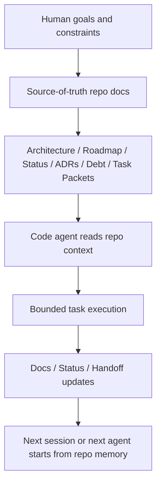
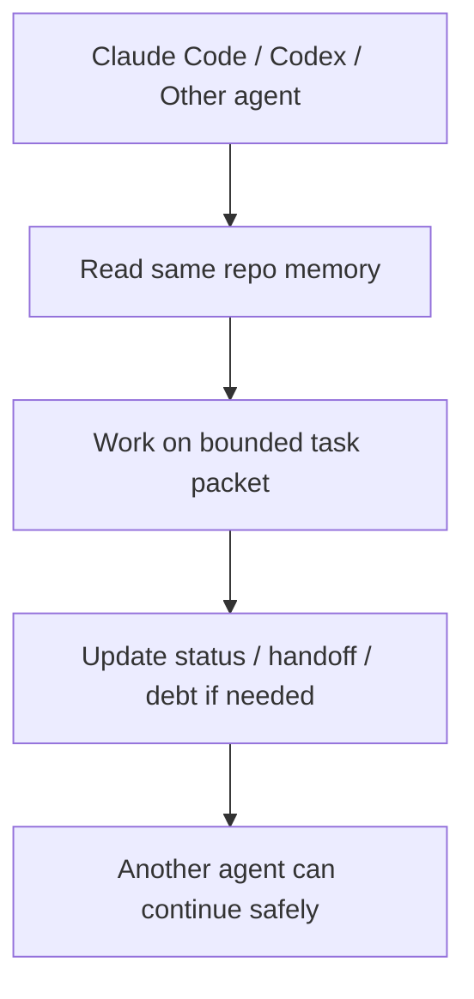
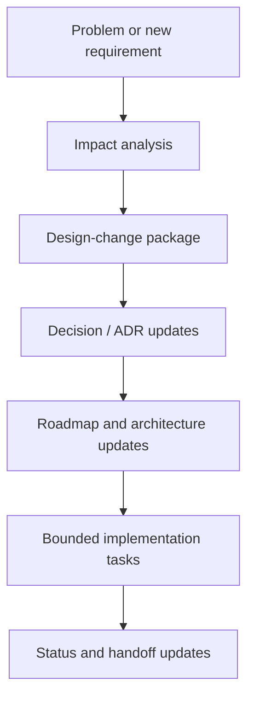
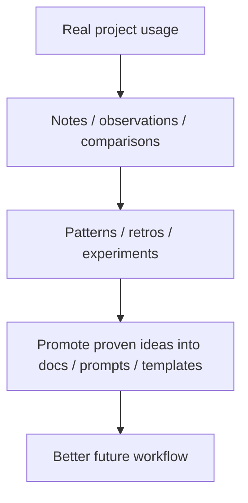
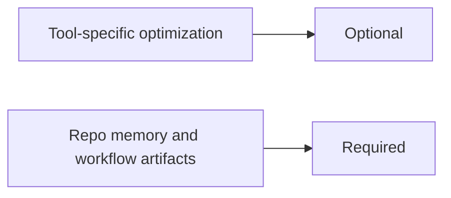

# Mermaid Workflow Diagrams

These diagrams are a richer visual version of `docs/workflow-diagrams.md`.

They are kept in Mermaid so they remain versionable and Markdown-friendly.

---

## 1. Core operating model

---

## 2. Mixed-agent workflow

---

## 3. Large change workflow

---

## 4. Daily improvement loop

---

## 5. Portable workflow rule

